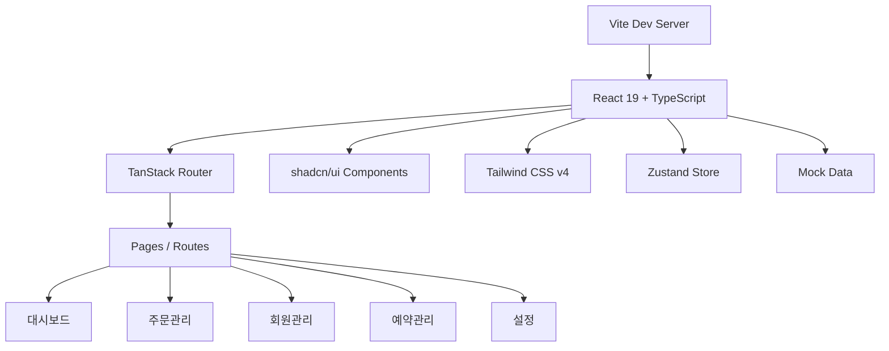

# Admin Pro — SaaS 어드민 대시보드

한국형 SaaS 어드민 대시보드. 주문/결제, 회원, 예약 관리 기능을 갖춘 프로페셔널한 관리자 패널입니다.

**[라이브 데모](https://frank-saas-dashboard.vercel.app/)**


## 스크린샷

### 대시보드 메인


### 주문 목록


### 주문 상세 (결제 정보)


### 회원 관리


### 예약 관리


## 주요 기능

- **대시보드** — 오늘 매출, 신규 주문, 신규 회원, 전환율 통계 카드 + 월별 매출 차트
- **주문/결제 관리** — 주문 목록 (필터, 검색, 페이지네이션) + 주문 상세 (토스페이먼츠 스타일 결제 정보)
- **회원 관리** — 회원 목록 (등급 VVIP/VIP/일반, 상태 필터) + 주문이력/누적결제금액
- **예약 관리** — 예약 목록 + 월간 캘린더 뷰 (날짜별 예약 건수)
- **설정** — 프로필, 계정, 테마(라이트/다크), 알림, 화면 설정
- **반응형 레이아웃** — 모바일/태블릿/데스크톱 대응
- **다크모드** — 라이트/다크 테마 토글

## 기술 스택

| 카테고리   | 기술                                   |
| ---------- | -------------------------------------- |
| 프레임워크 | Vite + React 19                        |
| 언어       | TypeScript (strict)                    |
| 라우팅     | TanStack Router (파일 기반)            |
| 상태관리   | TanStack React Query + Zustand         |
| UI         | Tailwind CSS v4 + shadcn/ui (Radix UI) |
| 차트       | Recharts                               |
| 폼/검증    | React Hook Form + Zod                  |
| 아이콘     | Lucide React                           |

## 아키텍처



## 로컬 실행

```bash
git clone https://github.com/tellmefrankie/saas-dashboard.git
cd saas-dashboard
pnpm install
pnpm dev
```

`http://localhost:5173`에서 확인할 수 있습니다.

## 빌드

```bash
pnpm build
pnpm preview
```

## 라이선스

MIT
